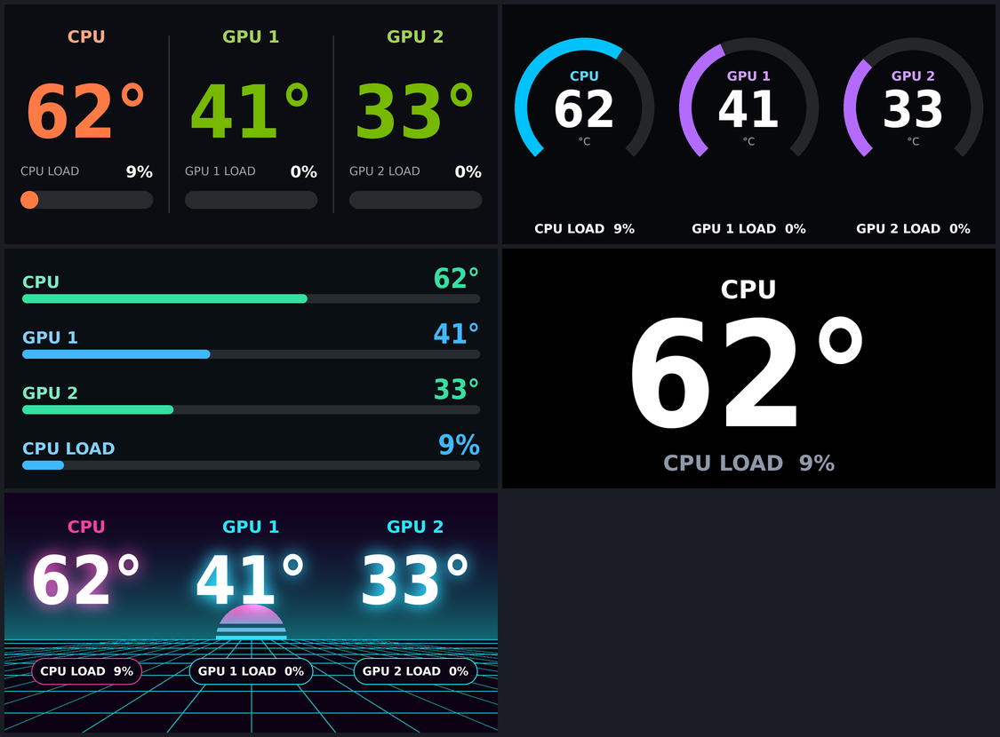

# Thermaltake 6" LCD Panel Kit on Linux

A Linux driver and dashboard for the **6.0" LCD Panel Kit for View 600 TG**
(`AC-080-OO1NAN-A1`, USB `264a:2347`). Thermaltake only supports it through
TT RGB Plus on Windows.

- Big, readable system-monitor templates, designed to be read from across the room
- Two GPUs? Each card gets its own column
- A tray icon with a Customize window and a live preview
- Runs as a systemd service and starts at boot



| Template | Style |
|---|---|
| Big numbers | two giant values with thick bars |
| Ring gauges | NZXT Kraken style |
| Bars | AIDA64 SensorPanel style, up to four rows |
| Single metric | one value, as large as the panel allows |
| Synthwave | 80s neon sunset |

Metrics: CPU temperature and load, GPU temperature, load, power and VRAM
(NVIDIA via `nvidia-smi`), RAM, SSD temperature and fan speed. Values turn
amber and then red as they approach their limits.

## Install

Needs Python 3, Pillow and psutil. The tray app also needs PyGObject with
GTK 3 and Ayatana AppIndicator. On GNOME, the AppIndicator extension must be
enabled; Ubuntu enables it by default.

```sh
git clone https://github.com/deniswsrosa/thermaltake-6inch-lcd-linux.git
cd thermaltake-6inch-lcd-linux
./install.sh
```

`install.sh`:

1. installs the udev rule, so the panel is accessible without root
2. installs missing dependencies (apt, or pip as a fallback)
3. creates and starts the `tt600d` systemd user service, and enables
   lingering so it starts at boot without a login
4. adds the tray app to autostart and to the app grid as "Thermaltake LCD"

## Using it

The **tray icon** menu has quick switches for the template, °C/°F and
brightness. **Customize…** opens a window with a live preview where you pick
the template, the metric in each slot, colours, the combined-GPU mode and the
update rate. Changes apply to the panel immediately.

Settings are stored in `~/.config/tt600/config.json`, and the service reloads
the file whenever it changes, so you can also edit it by hand.

```sh
systemctl --user status tt600d          # is it running?
journalctl --user -u tt600d -f          # logs
systemctl --user restart tt600d
```

## Command-line tools

```sh
python3 tt600d.py                       # the dashboard daemon, in the foreground
python3 tt600d.py --preview out.png     # render one frame with the current settings
python3 tt600-tray.py                   # the tray app
python3 tt600.py status                 # handshake and print the panel's status JSON
python3 tt600.py image photo.png        # show an image (until Ctrl-C, or --hold N)
python3 tt600.py testpattern            # corner-marked frame for checking orientation
python3 tt600.py brightness 60
python3 tt600.py rotate 270
python3 tt_probe.py                     # read-only: identify, decode descriptor, listen
```

## Adding a template

Templates live in `templates.py`. A template is a function
`(canvas, values, cfg)` that draws in panel pixels (1110×540), plus an entry
in `TEMPLATES` with its slot names and colours. Default metrics come from
`defaults()`. The new template shows up in the tray automatically.

## The hardware

| | |
|---|---|
| USB ID | `264a:2347` |
| Interfaces | 1 (HID), interrupt IN and OUT, 1024 bytes each, no report IDs |
| Panel | 6" TFT, 1480×720 physical; frames are sent at **1110×540** |
| Controller | embedded Linux (app V1.0.7, firmware V1.2.7, hardware V2.0) |

## Protocol

The protocol was recovered from TT RGB Plus 3.0.9 (its `Device_LCD_BY_6inch`
class and `BYProtocol.dll`). Every report is 1024 bytes, written to hidraw as
`0x00` + 1024 bytes.

### Commands

HTTP-like text, one per report, and the panel answers on the IN endpoint:

```
POST conn 1\r\n
SeqNumber=112\r\n
ContentType=json\r\n
ContentLength=<n>\r\n
\r\n
<json body>
```

Each message is framed:

```
5A | len_be16 | payload | sum8 | 5A
```

- `len` is the whole unescaped frame length (payload + 5).
- `sum8` is the sum of the length bytes and payload, mod 256.
- Between the two `5A`s, `5A` is escaped to `5B 01` and `5B` to `5B 02`.

Replies use the same framing, with status `1 200`, `AckNumber=113` and an
optional JSON body.

| Command | Body | Notes |
|---|---|---|
| `POST conn 1` | none | handshake; replies with versions, `brightness`, `degree`, `timeout`, … |
| `POST realtimeDisplay 1` | `{"enable":true}` | switch to live frames |
| `POST brightness 1` | `{"value":0-100}` | |
| `POST rotate 1` | `{"degree":N}` | |
| `POST transport 1` / `POST transported 1` | file name, size, md5 | standby/boot media and firmware upload (not implemented) |

### Frames

A frame is a JPEG of exactly 1110×540 (or 540×1110), at most `0xC7FFF` bytes,
sent in 1000-byte slices, one per report:

```
[0] 5C [1] 03 [2] FD [3] counter (0-59, +1 per frame)
[4..5] total slices, big-endian   [6..7] slice index, big-endian   [8] 01
[9..23] zero
[24..1023] JPEG data, zero-padded
```

The panel returns to its own screen when frames stop for `timeout` seconds
(5 by default), so the daemon keeps sending at least every few seconds.

## Why not the existing Thermaltake Linux tools?

The open-source drivers for the sibling panels (pcmx1/thermaltake-lcd-linux,
ttlcd, thermaltaked, th420-display) target 480×128 and 480×480 screens with
MCU controllers and the "ultra" and "rcpro" protocols. This panel ignores
those protocols and stalls their feature reports. It is a different
controller that runs embedded Linux and speaks the BY protocol above.

## License

MIT. Not affiliated with Thermaltake.
